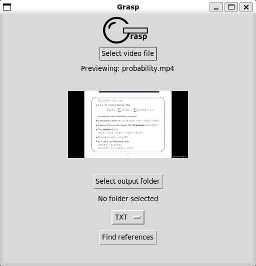
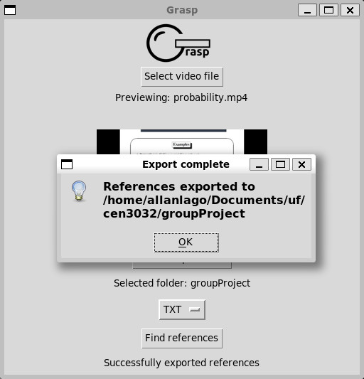
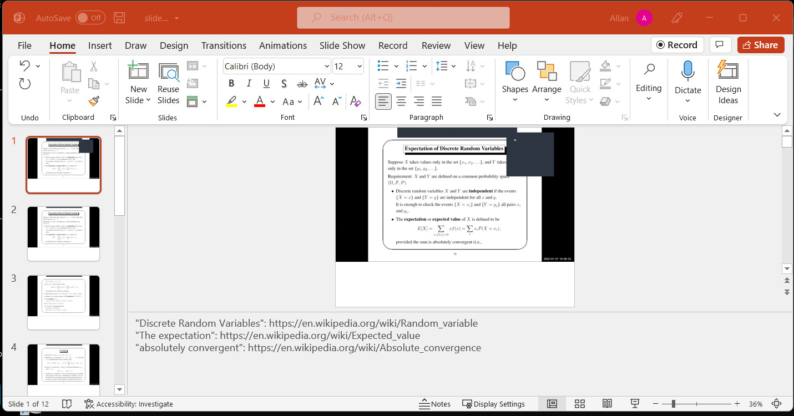

# Grasp
Grasp is an easy-to-use tool that streamlines the flow of information involved in studying.

Grasp is written primarily for remote-learning students with access to recorded lectures. In addition to aiding students taking notes, it can also be used by educators to provide more resources to students easily.

Grasp takes a recorded video and extracts slides from the video. In addition to extracting slides, it adds references to topics referenced in the slide to the slide's comments. It also exports a summary view of topics in a Markdown formatted text file.

OS Build Tested: Ubuntu LTS 20.04.04
Dependencies: python3.9, pipenv

### File Structure

- `src/` has all the source code. The main entrypoint is `main.py`.
- `src/tests/` is where all the tests should be located

##### Running

Python 3.9 should be pre-installed in Ubuntu 20.04. If that is not the case, follow this tutorial: https://linuxize.com/post/how-to-install-python-3-9-on-ubuntu-20-04/ 

### Installing with a script:
1. Install python3.9 and pip3 with `apt install python3.9 python3-pip`
2. In the project directory, run `chmod +x install.sh`
3. Run `./install.sh`

### Manual Installation:
1. Make sure you have python 3.9 installed. Then, run `python3.9 -m pip install pipenv`.
2. In the project directory, run `python3.9 -m pipenv install` and `python3.9 -m pipenv install --system`.
3. Run `pre-commit install`. This should be enough so, to verify, run `pre-commit run --all-files`. All processes should pass.
4. Run `python3.9 -m pipenv run spacy download en_core_web_sm`.
5. Create a .env with `touch .env` for holding cloud credentials. Write the credentials location with `echo ‘GOOGLE_APPLICATION_CREDENTIALS="cloud_credentials.json"’ > .env`
6. Fill in `cloud_credentials.json` with the API key for Google Cloud. This is obtained from Google Cloud. For this project we provide the json file in Appendix 1.

### Running Grasp:
cd to the parent directory of grasp. ls should display the directory src.
Run `pipenv shell` to enter the python virtual environment. 
While in the virtual environment, run `python src/main.py` to enter the grasp GUI. From there, select a video to parse. Alternatively, `pipenv run python src/main.py` can be run without entering the pipenv shell.

### Troubleshooting:
If running step 3 returns an error, some packages may need to be updated. 
Update the virtual environment packages with `pipenv update`.
If step 1 still fails, update spacy and black directly. Run `pipenv install spacy` and `pipenv install black`. Updating spacy’s dictionary can be performed by `pipenv run python -m spacy download en_core_web_sm`.